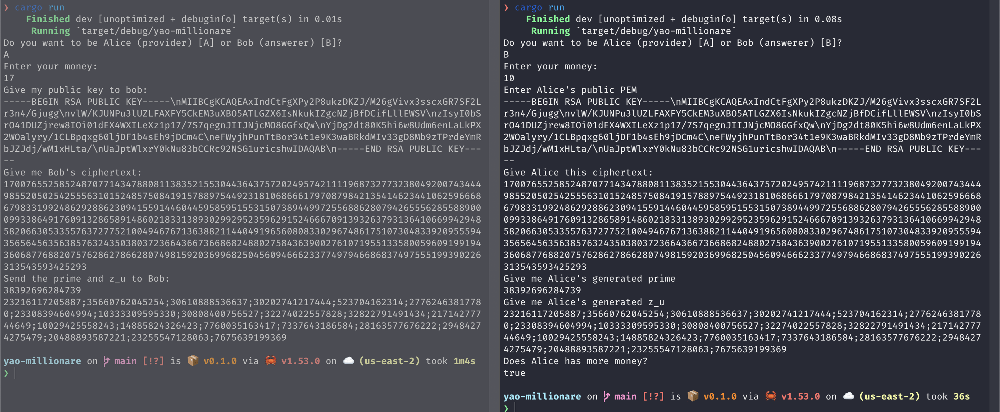

# Yao's Millionaire Problem

> Two millionaires wish to know who is richer; however,
they do not want to find out inadvertently any additional
information about each other’s wealth. How can they
carry out such a conversation?

This repository has an implementation of Yao's Millionaire Problem following the [Protocols for secure computations](https://ieeexplore.ieee.org/document/4568388) paper.

## Usage

Split you terminal in two, `cargo run` and follow the wizard.

